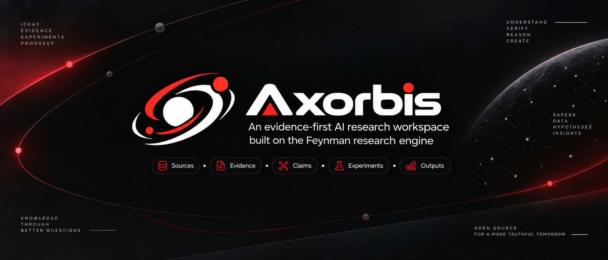

<div align="center">

# Axorbis

**An evidence-first AI research workspace for turning questions into traceable, reproducible research.**

Questions · Sources · Claims · Experiments · Outputs — kept together in one local, auditable workspace.



[](./LICENSE)

[Quick Start](#quick-start) · [Research Workflows](#research-workflows) · [How It Works](#how-it-works) · [Security](#security)

</div>

---

## What is Axorbis?

Axorbis is a desktop research workspace built on the Feynman research engine.

It brings research questions, sources, claims, evidence, experiments, and generated outputs into one place so that findings remain connected to the evidence behind them.

Instead of treating AI research as a sequence of isolated chat sessions, Axorbis organizes the work into a local, inspectable research process.

## Why Axorbis?

Research often fragments across browser tabs, papers, notebooks, scripts, and chat windows. That makes it difficult to answer a basic question:

**Where did this conclusion come from?**

Axorbis is designed around evidence traceability. Claims stay connected to sources, research workflows share the same workspace, and provider configuration remains under your control.

The result is a research environment built for discovery, verification, synthesis, and reproducibility rather than isolated text generation.

---

## Quick Start

### Requirements

* Node.js 22.22–25.x
* npm
* Rust
* [Tauri system dependencies](https://v2.tauri.app/start/prerequisites/)

### Run from source

```bash
git clone https://github.com/AIAI-Laboratory/axorbis.git
cd axorbis

nvm use || nvm install

npm ci
npm ci --prefix app

npm run desktop:dev
```

### Configure an AI provider

From the command line:

```bash
npm run dev -- setup
```

Or open:

**Settings → AI Providers**

Axorbis supports provider configuration for Anthropic, OpenAI, Gemini, OpenRouter, LM Studio, Ollama, LiteLLM, and custom providers.

---

## What You Get

### Evidence you can inspect

Research is organized around sources, claims, and evidence rather than disconnected model responses.

You can inspect how findings relate to their supporting material and keep research artifacts inside the same workspace.

### Research workflows from one composer

Axorbis exposes 12 research modes for tasks ranging from literature review and comparison to replication planning, auditing, drafting, and bounded experiment loops.

The same research question can move through multiple workflows without rebuilding context from scratch.

### A local desktop research environment

Axorbis runs as a Tauri desktop application with local workspace storage, managed backend lifecycle, encrypted provider credentials, tokenized localhost sessions, and configurable AI providers.

---

## Research Workflows

The composer maps each research mode to a workflow in the Feynman engine.

| Mode                  | Command         | Purpose                                                    |
| --------------------- | --------------- | ---------------------------------------------------------- |
| **Ask**               | Free-form       | Ask questions about the current research problem           |
| **Deep Research**     | `/deepresearch` | Run source-heavy investigation with inline citations       |
| **Literature Review** | `/lit`          | Review papers by topic, lab, PI, or author                 |
| **Summarize**         | `/summarize`    | Summarize a paper, report, or research artifact            |
| **Compare**           | `/compare`      | Build a source-grounded comparison matrix                  |
| **Audit**             | `/audit`        | Compare claims against public code for reproducibility     |
| **Recipe**            | `/recipe`       | Find ranked, implementable ML training recipes             |
| **Replicate**         | `/replicate`    | Plan replication of a paper, result, or claim              |
| **Auto Research**     | `/autoresearch` | Run a bounded experiment loop with hypothesis testing      |
| **Watch**             | `/watch`        | Establish a research watch baseline and follow-ups         |
| **Draft**             | `/draft`        | Turn findings into a polished paper-style draft            |
| **Review**            | `/review`       | Produce internal critique, objections, and a revision plan |

When a workflow other than **Ask** is selected, pressing Enter uses the current research question as the workflow input.

Typing in the composer overrides that default.

---

## How It Works

Axorbis keeps the research process centered on a project and its research question.

A typical path is:

**Question → Sources → Claims → Evidence → Analysis → Output**

Different workflows operate on that shared research context. Deep Research can gather evidence, Compare can structure it, Audit can challenge claims, Replicate can turn findings into an execution plan, and Draft can transform the resulting work into a polished artifact.

This shared workspace is the core of Axorbis: research modes are different tools working over the same body of evidence.

---

## AI Provider Management

Axorbis uses a bring-your-own-key model and supports:

`Anthropic` · `OpenAI` · `Gemini` · `OpenRouter` · `LM Studio` · `Ollama` · `LiteLLM` · custom providers

Provider management includes encrypted credentials, token and cost tracking, monthly budgets, and configurable hard stops.

Provider secrets are stored encrypted and are not returned to the UI.

---

## Desktop Architecture

Axorbis is packaged as a native application with Tauri.

The desktop layer handles workspace selection, application startup, tray behavior, native commands, packaging, and the lifecycle of the local backend.

The backend is bound to `localhost` and accessed through tokenized sessions.

---

## Security

Axorbis is designed around local research ownership:

* Research state, artifacts, and sessions remain in the selected workspace.
* Provider credentials are encrypted at rest.
* Provider secrets are not returned to the UI.
* The desktop backend binds to `localhost`.
* Sessions use tokenized URLs.
* The project states that it does not use telemetry or cloud synchronization.

---

## Build & Release

Run the verification checks:

```bash
npm run typecheck
npm run desktop:check
```

Create a development build:

```bash
npm run desktop:build
```

Create a self-contained release with a native installer:

```bash
npm run desktop:release-build
```

---

## Repository Layout

```text
engine/       Feynman research engine, CLI, and Workbench backend
web/          UI source bundled into the desktop application
app/          Tauri host, native commands, icons, and packaging
prompts/      Research workflow prompt definitions
extensions/   Pi research tools and integration extensions
img/          Axorbis icon and banner assets
scripts/      Build, staging, and verification scripts
tests/        Engine, Workbench, and desktop tests
website/      Documentation site sources
```

---

## Project Direction

Axorbis preserves the Feynman open research engine while developing a native workspace around it.

The project is focused on capabilities that improve:

**discovery · reading · evidence ranking · verification · reproduction · synthesis · research observability**

The goal is not simply to produce more AI-generated text, but to make research outputs easier to inspect, trace, challenge, and reproduce.

---

## License

Axorbis is released under the [MIT License](LICENSE).

---

<div align="center">


**Research beyond convention. Pursuing truth**

</div>
