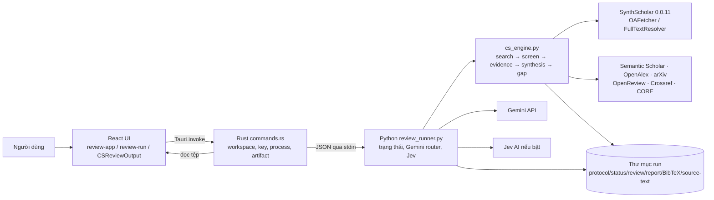

# Kiến trúc literature review hiện tại của Axorbis (bản tạm)

> Bản tạm dựa trên mã nguồn trong workspace ngày 30/09/2026. Mục 1–14 là **baseline trước khi sửa**; mục 15 ghi trạng thái triển khai sau khi xử lý danh sách hạn chế. Đã chạy lại một review thật qua các provider và Gemini; đây là kiểm tra vận hành, chưa xác nhận độc lập chất lượng khoa học.

> **Cập nhật sau bản phân tích:** Mục 1–14 bên dưới ghi lại kiến trúc gốc và các vấn đề được nêu trước khi sửa code. Xem **mục 15** để biết phần nào đã được triển khai, phần nào còn giới hạn. Các phát biểu “hiện tại” trong mục 1–14 cần được đọc như baseline lịch sử.

**Luồng đang triển khai:** form tạo protocol tổng quát hoặc template chuyên biệt → Rust tạo thư mục run và manifest bất biến → Python lập chiến lược tìm kiếm, tìm và mở rộng citation tùy chọn → sàng lọc với trạng thái chưa chắc chắn rõ ràng → truy xuất và phân loại evidence có span/ngữ cảnh → dựng ma trận, claim và candidate gap → counter-search theo ngân sách → ghi JSON, Markdown, BibTeX, trạng thái và log. Run dở dang có thể tiếp tục từ dữ liệu đã lưu khi protocol và phiên bản engine khớp; quyết định thủ công được ghi lịch sử và tái dựng kết quả. Những phần còn **Một phần** trong bảng mục 15 không được xem là đã giải quyết trọn vẹn.

## 1. Phạm vi và mô hình tổng thể

Axorbis là ứng dụng desktop Tauri 2. Giao diện React/TypeScript ở `web/` gửi lệnh IPC cho Rust ở `app/src-tauri/`. Rust quản lý workspace, khóa API, vòng đời tiến trình và tệp của từng review. Mỗi lượt chạy khởi động một tiến trình Python `integration/review_runner.py`; tiến trình này điều phối `integration/cs_engine.py`, sử dụng các client tìm kiếm/toàn văn công khai của SynthScholar 0.0.11, gọi Gemini và tùy chọn Jev AI. Kết quả chính là tệp trong thư mục review, không phải một cơ sở dữ liệu ứng dụng.



SynthScholar ở đây cung cấp client truy xuất nguồn và toàn văn. Quy tắc sàng lọc, mô hình bằng chứng, tổng hợp và kiểm tra gap nằm trong `cs_engine.py`; pipeline PRISMA/Risk of Bias/GRADE của SynthScholar không được gọi.

## 2. Thành phần và trách nhiệm

| Thành phần | Trách nhiệm hiện tại |
| --- | --- |
| `web/src/review-app.tsx` | Form tạo/sửa/chạy lại; chọn workspace/project/key/chế độ sàng lọc; danh sách review; gọi Tauri; hiển thị các tab kết quả và tệp. |
| `web/src/review-run.tsx` | Monitor chín giai đoạn, bài báo, tiến độ, thời gian, mức sử dụng Gemini và log. Giai đoạn được suy từ chuỗi thông báo tiến độ. |
| `web/src/cs-review-output.tsx` | Hiển thị schema `cs_literature_intelligence_v*`: tổng quan, claims, gaps, ma trận, phương pháp và chẩn đoán. `review-output.tsx` là đường hiển thị tương thích dữ liệu cũ. |
| `web/src/reference-graph.tsx` | Biểu diễn mạng trích dẫn sau review; chọn bài, xem danh sách tài liệu tham khảo, chế độ overview và subgraph. |
| `app/src-tauri/src/commands.rs` | IPC, quản lý một tiến trình review đang chạy, bootstrap Python, đọc/ghi tệp, mở thư mục, đồ thị trích dẫn và quản lý key. |
| `integration/review_runner.py` | Điểm vào tiến trình Python; đọc payload stdin, viết `protocol.json`/`status.json`, lọc bí mật khỏi thông báo, ghi audit Gemini, gọi engine, xử lý lỗi. Có thêm chế độ phụ `--citation-graph` và `--crossref-article`. |
| `integration/cs_engine.py` | Logic systematic literature review cho Computer Science: hoạch định truy vấn, tìm/khử trùng lặp, sàng lọc, truy xuất toàn văn, chọn bằng chứng, dựng ma trận/claims/directions/gaps và xuất báo cáo. |
| `integration/requirements.txt`, `integration/setup.py` | Pin SynthScholar `0.0.11` cùng dependency và cài runtime Python. |

`literature-map-web/` là website tra cứu DOI/tiêu đề độc lập; không nằm trong luồng review của desktop. Đồ thị trích dẫn trong màn hình kết quả desktop là một tác vụ truy xuất bổ sung sau review, không phải nguồn bắt buộc để engine tổng hợp claims.

## 3. Khởi động và cấu hình

1. Khi mở ứng dụng, UI gọi `review_environment`. Rust kiểm tra interpreter bằng cách import SynthScholar. Nếu thiếu, UI gọi `install_review_environment` một lần. Bản phát triển dùng `.venv` trong checkout; bản đóng gói dùng runtime riêng trong `~/.axorbis/runtime/.venv`. Trên macOS có cơ chế tải Python 3.11 standalone được pin và xác minh SHA-256 nếu thiếu interpreter tương thích. Biến `SYNTHSCHOLAR_PYTHON` cho phép chỉ định interpreter đã cài dependency.
2. Workspace mặc định là `SYNTHSCHOLAR_WORKSPACE` hoặc `~/SynthScholar Reviews`. UI nhớ **đường dẫn workspace và theme** trong `localStorage`; không lưu API key ở đó. Project là nhãn nhóm câu hỏi trong `status.json`, không phải một tầng thư mục riêng.
3. Form hiện thấy gồm topic, objective, core concepts, related concepts, project, giới hạn kết quả mỗi query (1–100), chế độ Gemini/Jev và chọn Gemini key. Kiểu dữ liệu `ReviewInput`/protocol còn chứa inclusion/exclusion và khoảng ngày, nhưng các trường đó không xuất hiện trong form khởi tạo hiện tại; giá trị mặc định là chuỗi rỗng.
4. Tối thiểu một Gemini key là bắt buộc kể cả khi chọn Jev. Jev chỉ thay phần phân loại scope. Các key nguồn OpenAlex, Semantic Scholar và CORE là tùy chọn.

## 4. Tạo run và luồng điều khiển

`start_review` kiểm tra đầu vào, từ chối nếu đã có một child process review đang chạy, rồi tạo `<slug>-<timestamp-millisecond>/` trong workspace. Rust ghi `status.json` với `state=running`, input, project, key selection, thông tin run; chuẩn bị `runner.log`; khởi động Python với **đường dẫn runner và thư mục run** trong argv. Payload JSON gồm protocol, giới hạn kết quả, model, các API key và chế độ sàng lọc được ghi vào **stdin** của Python. Các biến môi trường key tương ứng bị loại khỏi môi trường child.

Python đọc trọn payload stdin, ghi `protocol.json`, tạo bộ định tuyến Gemini và cập nhật `status.json` qua callback có khóa đồng bộ. Engine viết snapshot `review.json`, `review.md`, `references.bib` khi đã qua sàng lọc và trong quá trình tải toàn văn/counter-search; bản cuối ghi lại ba tệp này. `status.json` chứa tiến độ và các chỉ số có thể xem trong lúc chạy. `runner.log` là stdout/stderr của child. UI không nhận stream sự kiện: danh sách được poll mỗi 2,5 giây; review đang chọn được poll mỗi 750 ms khi chạy và 2,5 giây khi dừng.

Lệnh dừng giết tiến trình Python, đặt `state=cancelled` và giữ các tệp đã ghi. Khi app đóng, Tauri cũng dừng child. Lần mở sau, thư mục còn `running` nhưng không thuộc child hiện hành được đánh dấu `interrupted`. `sync_active` đánh dấu `failed` nếu child thoát mà chưa đặt trạng thái cuối. Chạy lại tạo thư mục mới và tìm kiếm lại; `sourceReviewId` chỉ liên kết nguồn trong metadata. Tham số `resumeCheckpoint` hiện bị bỏ qua, nên chưa có resume từ checkpoint.

## 5. Pipeline khoa học theo thứ tự thực thi

### 5.1. Hiểu câu hỏi và lập truy vấn

`concepts_from_input` lấy objective hoặc title, phân tách core/related concepts. Gemini được gọi để đề xuất `core_concepts` và `related_concepts` dạng JSON khi người dùng không nhập rõ. Nếu cuộc gọi này lỗi, run lỗi thay vì dùng regex để sàng lọc. `search_strategy` tạo query neo vào các core concepts, tối đa 12 query cho nhiều nguồn, 6 cho Crossref và 8 cho CORE. Chiến lược cùng provider/query/thời điểm/số bản ghi/lỗi được lưu trong kết quả để truy vết.

### 5.2. Tìm kiếm và hợp nhất bản ghi

Engine dùng `OAFetcher` của SynthScholar cho Semantic Scholar, OpenAlex, arXiv, Crossref và CORE; `OpenReviewProvider` riêng cho OpenReview. Tìm kiếm được thực hiện theo provider và query, với `maxResults` là giới hạn **mỗi query**. Lỗi của một query được ghi vào provenance và không tự hủy toàn bộ lượt tìm.

Hợp nhất ưu tiên DOI chuẩn hóa, arXiv ID, tiêu đề chuẩn hóa chính xác, rồi so khớp mờ tiêu đề với tác giả/năm tương thích (ngưỡng 0,94). DOI/arXiv xung đột không được hợp nhất mờ. Bản ghi giữ nguồn gốc provider, các query đã tìm ra nó, liên kết bài/PDF, abstract và metadata. Abstract thiếu được bổ sung từ Semantic Scholar, OpenAlex, Crossref hoặc metadata của trang nhà xuất bản.

### 5.3. Sàng lọc scope

Mặc định Gemini chấm từng lô tối đa 8 bài, trả ba điểm nguyên `100/50/0`, tương ứng `YES/UNKNOWN/NO`. Ba tiêu chí hiện **cố định** là: temporal/dynamic knowledge graph; inductive generalization; và task phù hợp. `core` yêu cầu cả ba `YES`; `background` là trường hợp còn chưa chắc; `exclude` khi tiêu chí đầu hoặc thứ ba là `NO`, hoặc bị loại bằng ràng buộc cơ học của protocol. Trạng thái lưu trên bài là `include`, `manual_review`, `exclude`. Khi bật Jev, Jev chấm riêng từng bài trên cùng ba chiều và Gemini vẫn phụ trách lập truy vấn, chọn bằng chứng, phân tích.

Ngày xuất bản, ngôn ngữ và loại công bố là các kiểm tra protocol cơ học. Thiếu năm trong trường hợp đã đặt khoảng ngày có thể khiến bài bị loại. Khi lấy được toàn văn, bài đủ điều kiện được sàng lọc lại; chế độ Jev giữ Jev là bộ quyết định scope. Không có bộ phân loại khoa học bằng regex để thay Gemini/Jev nếu response lỗi. Các response thiếu hàng hoặc sai schema gây lỗi run.

### 5.4. Truy xuất nguồn và chọn bằng chứng

Chỉ bài `include` và `manual_review` được thử lấy toàn văn bằng `FullTextResolver`; tối đa bốn tác vụ cùng lúc. Có đường dự phòng tải PDF arXiv tối đa 25 MB. Toàn văn tìm được lưu thành `source-text/A-<n>.txt`; nếu không có, bài giữ `abstract_only` hoặc `metadata_only`, không bị loại chỉ vì paywall.

`evidence_candidates` cắt câu trực tiếp từ toàn văn/abstract, giữ `exact_text`, vị trí ký tự đầu/cuối, `article_id`, `source_level`. Mỗi nguồn được lấy mẫu tối đa 60 câu hợp lệ. Gemini nhận **ID và nguyên văn các candidate** rồi chọn loại bằng chứng, dimensions, câu đủ tư cách làm claim và vài trường profile. Kết quả được đối chiếu lại với candidate đã lưu; claim cuối luôn chỉ đến evidence ID và đoạn nguồn cụ thể. Abstract là bằng chứng mức hạn chế; record chỉ có metadata không sinh scientific claim.

### 5.5. Tổng hợp study, ma trận và claims

`build_outputs` chỉ lấy `core` cho StudyProfile, evidence matrix và các thống kê trung tâm; `background` vẫn có trong corpus và xuất BibTeX. Profile gom task, method, contribution, dataset, metric, baseline, limitation, failure mode, future work và evidence ID. Ma trận cho các chiều đánh giá trả `YES`, `NO`, `UNKNOWN`, `NOT_APPLICABLE`: `NO` chỉ được suy từ phủ định tường minh trong toàn văn; sự im lặng là `UNKNOWN`.

Paper claim lấy từ câu được chọn, đủ trọn nghĩa và có evidence ID. Cross-paper claim gắn các bài và evidence hỗ trợ, với ngưỡng tối thiểu thay đổi theo loại claim (mẫu lặp, so sánh, coverage). Research directions báo số bài xác định, số đã review sâu bằng toàn văn, coverage và maturity (`established`, `developing`, `emerging`, `sparse`, `uncertain`). `quality_gate.passed` hiện cần ít nhất một paper claim và basic evidence coverage của core ≥ 0,7; `deep_evidence_sufficient` được đo riêng ở ngưỡng 0,5.

### 5.6. Gap ứng viên và xác minh

Engine tìm các tổ hợp chiều đánh giá thưa từ ma trận; `UNKNOWN` không bị tính thành `NO`. Emerging/sparse directions và underexplored intersections được xuất riêng, không tự động gọi là verified gap. Hiện `build_outputs` dừng sau **candidate đầu tiên** đạt quy tắc; `run` cũng chỉ đưa candidate đầu tiên vào bước counter-search. Tên biến `candidate_gaps` là số nhiều nhưng khả năng xác minh thực tế bị giới hạn như vậy.

Nếu có candidate, engine kiểm tra evidence toàn văn cục bộ. Thiếu ít nhất hai bài hỗ trợ và hai bài có full-text span thì kết luận `inconclusive` (có nhánh abstract support riêng). Nếu đạt, engine chạy truy vấn phản chứng theo ba cách gọi thay thế, phân bổ qua arXiv, Semantic Scholar, OpenAlex; bài mới được sàng lọc và lấy/chọn bằng chứng như corpus. Có bài phản chứng toàn văn thì `already_addressed`; có bài khả dĩ thì `partially_addressed`; chỉ khi cả ba tìm kiếm hoàn thành không lỗi, coverage sâu cục bộ ≥ 0,8 và không thấy phản chứng mới được `verified_gap`. Khi không có candidate, pipeline có thể kết thúc ở `mapping_complete`; nếu quality gate không qua là `insufficient_evidence`.

## 6. Dữ liệu và hợp đồng tệp

```text
<workspace>/<slug>-<timestamp>/
  protocol.json          # protocol nhận từ form khi bắt đầu
  status.json            # state, progress, article rows, metrics, key usage
  review.json            # kết quả có cấu trúc; schema cs_literature_intelligence_v3
  review.md              # báo cáo Markdown sinh từ review.json
  references.bib         # thư mục tài liệu tham khảo
  runner.log             # stdout/stderr của Python
  gemini-calls.jsonl     # audit request/response Gemini (nếu có lệnh gọi)
  source-text/A-*.txt    # toàn văn đã trích xuất khi lấy được
  citation-graph.json    # cache tùy chọn, tạo khi mở đồ thị và tra cứu hoàn chỉnh
```

`review.json` chứa `search_strategy`, `search_provenance`, `articles`, `screening_results`, `evidence_spans`, `study_profiles`, `evidence_matrix`, `paper_claims`, `cross_paper_claims`, `research_directions`, `candidate_gaps`, `verified_gaps`, `quality_gate`, `stage_statuses`, `gap_verification`, `pipeline_status`. Các alias như `screening_decisions`, `atomic_claims`, `research_gaps` hỗ trợ giao diện/folder cũ. `status.json` là nguồn của danh sách và monitor; `review.json` là nguồn có cấu trúc cho các tab kết quả. Không phải mọi tệp đều tồn tại nếu run bị dừng hoặc lỗi sớm.

## 7. Giao diện kết quả và đồ thị trích dẫn

UI có các tab tiến trình, tổng quan, khẳng định, gaps, ma trận bằng chứng, bản đồ trích dẫn, truy vấn/sàng lọc, chất lượng, báo cáo, tệp. File preview đi qua `read_review_artifact` với danh sách tên cho phép và giới hạn 10 MB. `open_review_output` mở thư mục run bằng file manager của hệ điều hành. Sửa câu hỏi chỉ thay `status.json` cho lượt chạy sau; `protocol.json` và báo cáo cũ là snapshot của lượt cũ. Lệnh xóa trong UI xóa toàn bộ thư mục review đã chọn sau hộp xác nhận.

Đồ thị trích dẫn gọi Tauri `reference_graph` khi cần. Python tra references bằng Crossref và OpenAlex, rồi thử Semantic Scholar nếu hai nguồn chưa có refs; OpenReview bổ sung metadata của bài review. Tra cứu tối đa bốn bài đồng thời, hợp nhất references theo DOI/tiêu đề và giữ lỗi riêng từng bài. Cache `citation-graph.json` version 9 chỉ được ghi khi không có lookup thất bại; người dùng có thể refresh. Đây là metadata trích dẫn từ chỉ mục công khai; bài không có refs trong chỉ mục có thể vẫn đứng riêng. Đồ thị này không tự tạo thêm evidence span/claim cho `review.json`.

## 8. Bảo mật và quan sát vận hành

- Rust lấy Gemini key từ môi trường hoặc tệp key cục bộ, chọn tự xoay hoặc một key. Key nhà cung cấp và Jev cũng được đọc ở host. Payload key truyền sang Python qua stdin, không nằm trong argv, review folder hay browser storage. Các biến key bị gỡ khỏi môi trường child.
- `GeminiKeyRouter` quản lý hàng đợi key, tối đa ba lần thử với lỗi tạm thời, và xuất requests/tokens/key state vào `status.json`. Model hiện đặt từ Rust là `gemini-3.5-flash-lite` qua endpoint OpenAI-compatible của Gemini. Constructor có tham số `interval_seconds=5.0`, nhưng code hiện không dùng tham số này để chờ giữa các request; vì vậy không thể coi đây là bảo đảm giãn cách 5 giây.
- `gemini-calls.jsonl` ghi request body và raw response body để audit, không ghi Authorization header; chuỗi key đã cấu hình được thay `[REDACTED]`. File được mở với mode `0600` khi tạo. Body có thể chứa nguyên văn abstract/toàn văn và cần được coi là dữ liệu nghiên cứu nhạy cảm.
- Lỗi Python được ghi vào `status.json` và `runner.log`; thông báo được scrub bằng danh sách key. Lỗi provider tìm kiếm thường được lưu vào provenance để pipeline tiếp tục, còn lỗi schema Gemini/Jev ở bước bắt buộc có thể làm run `failed`.

## 9. Những giới hạn quan trọng của bản hiện tại

1. Dù người dùng có thể nhập topic CS khác, ba tiêu chí scope, nhiều profile dimensions/cross-paper patterns và vài mẫu gap vẫn gắn với temporal knowledge graph/inductive reasoning. Vì vậy tính tổng quát cho mọi chủ đề CS chưa đạt như tên sản phẩm có thể gợi ý.
2. “Tiếp tục” trong giao diện là chạy lại từ đầu trong thư mục mới; chưa khôi phục trạng thái từ checkpoint. Trong lúc một run đang chạy, app chỉ cho một run active.
3. Các stage của monitor được nhận diện từ thông điệp tiến độ; không phải state machine độc lập có checkpoint cho từng giai đoạn.
4. Gap verification hiện xử lý tối đa một candidate và dựa vào các nguồn counter-search cụ thể. `citation_expansion_history` trong kết quả hiện là danh sách rỗng; đồ thị refs mở sau review không đồng nghĩa đã mở rộng corpus khoa học.
5. `quality_gate.passed` đo coverage cơ bản và số paper claim. Đó là ngưỡng kỹ thuật của pipeline, không phải chứng nhận chất lượng phương pháp systematic review hay đánh giá thủ công của chuyên gia.
6. Form hiện tại không cho chỉnh inclusion/exclusion và khoảng ngày dù protocol/engine có trường tương ứng. Tài liệu này mô tả code hiện hành, nên các yêu cầu nghiên cứu nhập ngoài form chưa được xem là workflow UI hoàn chỉnh.
7. README mô tả khoảng cách tối thiểu 5 giây cho mỗi Gemini key, nhưng implementation hiện chưa thực thi nhịp chờ đó. Nếu giới hạn tốc độ là yêu cầu vận hành, đây là điểm cần sửa và kiểm chứng riêng.

## 10. Nguồn đối chiếu trong repository

- `app/src-tauri/src/lib.rs`, `app/src-tauri/src/commands.rs`: danh sách lệnh IPC, tạo/dừng run, thư mục, key, artifact, đồ thị.
- `integration/review_runner.py`: stdin payload, trạng thái, Gemini/Jev, audit và chế độ citation graph.
- `integration/cs_engine.py`: toàn bộ quy tắc tìm kiếm, sàng lọc, bằng chứng, tổng hợp, quality gate và gap verification.
- `integration/requirements.txt`, `integration/setup.py`: dependency và runtime.
- `web/src/review-app.tsx`, `web/src/review-run.tsx`, `web/src/cs-review-output.tsx`, `web/src/reference-graph.tsx`: hành vi desktop nhìn từ người dùng.
- `README.md`, `app/README.md`: mô tả sản phẩm hiện tại, được đối chiếu với implementation ở trên.

---

## 11. Hạn chế hiện tại và đề xuất cải tiến

Kiến trúc hiện tại của Axorbis đã hình thành được một pipeline literature review tương đối đầy đủ về mặt kỹ thuật: có tìm kiếm đa nguồn, hợp nhất bản ghi, sàng lọc bằng mô hình ngôn ngữ, truy xuất toàn văn, lưu evidence span, tổng hợp claim, xây dựng ma trận bằng chứng và thực hiện counter-search cho research gap. Hệ thống cũng có một số đặc tính tốt về khả năng truy vết, như lưu search provenance, liên kết claim với evidence ID và đoạn nguồn cụ thể, tách metadata-only khỏi scientific claim, lưu audit Gemini và giữ toàn bộ artifact của từng run trong một thư mục độc lập.

Tuy nhiên, implementation hiện tại vẫn có một số giới hạn quan trọng về tính tổng quát, độ tin cậy phương pháp, khả năng phục hồi lỗi và khả năng diễn giải kết quả. Các giới hạn này đặc biệt cần được xem xét nếu Axorbis được định vị như một công cụ systematic literature review tổng quát thay vì một pipeline evidence mapping chuyên biệt.

### 11.1. Logic sàng lọc hiện vẫn gắn với một miền nghiên cứu cụ thể

Hạn chế lớn nhất của engine hiện tại là ba tiêu chí scope dùng trong screening được cố định quanh temporal/dynamic knowledge graph, inductive generalization và task relevance. Trong khi đó, giao diện cho phép người dùng nhập các chủ đề Computer Science rộng hơn nhiều.

Điều này tạo ra sự không khớp giữa abstraction của sản phẩm và abstraction thực tế của engine. Một bài báo có thể hoàn toàn phù hợp với topic người dùng nhập nhưng vẫn bị loại chỉ vì không thỏa một trong các tiêu chí miền đã được hard-code. Do đó, search có thể tìm đúng corpus nhưng bước screening vẫn tạo ra systematic exclusion không liên quan đến research question hiện tại.

Đây không nên được xử lý chỉ bằng cách mở rộng thêm một số tiêu chí hard-code. Về kiến trúc, định nghĩa về relevance cần được chuyển ra khỏi `cs_engine.py` và trở thành một phần của review protocol.

Kiến trúc mục tiêu nên theo mô hình:

```text
Research Question
        ↓
Review Protocol
        ↓
Eligibility Criteria
        ↓
Extraction Schema
        ↓
Synthesis Plan
```

Các tiêu chí temporal knowledge graph hiện tại có thể tiếp tục tồn tại dưới dạng một template chuyên biệt, nhưng không nên là semantics mặc định của engine tổng quát.

### 11.2. `manual_review` chưa tương ứng với một bước adjudication thực sự

Engine hiện có thể đánh dấu bài là `manual_review` khi mô hình không đủ chắc chắn để xếp vào `core` hoặc `exclude`. Tuy nhiên, chưa có workflow độc lập cho người dùng hoặc reviewer xử lý trạng thái này trước khi synthesis.

Trong khi đó, `build_outputs` chỉ lấy nhóm `core` để tạo StudyProfile, evidence matrix và các thống kê trung tâm. Vì vậy, một bài mang trạng thái `manual_review` trên thực tế có thể bị loại khỏi synthesis mà không có quyết định thủ công nào xảy ra.

Điều này khiến uncertainty trong screening có nguy cơ trở thành implicit exclusion.

Nên thay mô hình trạng thái bằng ba lớp rõ ràng:

```text
included
excluded
needs_adjudication
```

Nếu hệ thống chạy ở chế độ hoàn toàn tự động, kết quả cuối cần thể hiện rõ rằng screening vẫn còn unresolved cases. Một hướng khác là chạy sensitivity analysis trên hai corpus:

```text
strict corpus   = included
expanded corpus = included + uncertain
```

Sau đó report có thể cho biết claim hoặc conclusion nào thay đổi khi các bài không chắc chắn được đưa vào phân tích.

### 11.3. Search resilience và search completeness hiện chưa được phân biệt đầy đủ

Một ưu điểm của implementation hiện tại là lỗi của một provider hoặc một query riêng lẻ không nhất thiết làm toàn run thất bại. Đây là lựa chọn tốt về độ bền của hệ thống.

Tuy nhiên, việc pipeline vẫn tiếp tục chạy không đồng nghĩa rằng search đã đủ đầy về mặt phương pháp.

Hiện có thể tồn tại trường hợp một số nguồn trả lỗi hoặc timeout nhưng pipeline vẫn tạo được corpus, paper claim và `quality_gate.passed`. Khi đó output kỹ thuật tồn tại, nhưng độ đầy đủ của literature search đã bị suy giảm.

Do đó cần tách rõ:

```text
execution success
```

và:

```text
search completeness
```

Search provenance hiện đã chứa dữ liệu cần thiết để xây dựng đánh giá này, gồm provider, query, số bản ghi và lỗi. Phần còn thiếu là propagate trạng thái search xuống quality assessment và synthesis.

Nên bổ sung các trạng thái như:

```text
complete
complete_with_limitations
degraded
insufficient
```

và ghi rõ các provider/query không hoàn thành.

### 11.4. `quality_gate.passed` hiện chưa đủ để đại diện cho chất lượng literature review

Quality gate hiện chủ yếu yêu cầu có paper claim và basic evidence coverage của core đạt một ngưỡng nhất định.

Các điều kiện này hữu ích để xác nhận rằng pipeline đã tạo được output có evidence, nhưng chưa đủ để kết luận review đạt chất lượng phương pháp.

Một review vẫn có thể đạt gate trong khi:

- một hoặc nhiều nguồn tìm kiếm bị lỗi;
- tỷ lệ lấy được full text thấp;
- còn nhiều bài chưa được adjudicate;
- corpus phụ thuộc mạnh vào abstract;
- chưa đánh giá chất lượng nghiên cứu;
- chưa kiểm tra contradiction có hệ thống;
- chưa thực hiện citation expansion;
- gap verification chỉ chạy trên một candidate.

Do đó không nên coi `quality_gate.passed` là một chứng nhận tổng hợp duy nhất.

Nên tách thành các quality dimension độc lập:

```text
search_completeness
screening_completeness
fulltext_coverage
evidence_coverage
study_quality_coverage
synthesis_support
gap_search_completeness
```

Ví dụ:

```json
{
  "quality": {
    "search": "degraded",
    "screening": "complete",
    "fulltext": "partial",
    "evidence": "adequate",
    "study_quality": "not_assessed"
  }
}
```

Trạng thái cuối có thể dùng các nhãn mô tả như `complete_with_limitations` thay cho một boolean `passed`.

### 11.5. Search hiện chưa tích hợp citation snowballing vào scientific corpus

Đồ thị trích dẫn hiện được tạo sau review khi người dùng mở tab citation map. Dữ liệu này phục vụ visualization và tra cứu, nhưng không đưa các bài mới tìm được trở lại corpus của review.

Điều này tạo ra khoảng cách giữa citation exploration và systematic search.

Một pipeline literature review mạnh hơn nên hỗ trợ:

```text
database search
      ↓
seed corpus
      ↓
backward citation search
      ↓
forward citation search
      ↓
screen new records
      ↓
repeat theo stopping rule
```

Infrastructure citation graph hiện tại có thể là nền tảng cho chức năng này, nhưng cần chuyển một phần logic từ tác vụ visualization sau review vào scientific pipeline.

Cho tới khi chức năng đó tồn tại, giao diện nên ghi rõ rằng citation graph là exploratory và không thay đổi corpus hoặc evidence trong `review.json`.

### 11.6. Evidence extraction hiện có một bottleneck trước khi LLM phân tích

Gemini hiện không đọc toàn bộ paper theo nghĩa trực tiếp. Engine trước tiên lấy mẫu tối đa một số câu hợp lệ từ full text hoặc abstract, sau đó mới gửi các evidence candidate này cho Gemini lựa chọn.

Luồng thực tế vì vậy là:

```text
full text
   ↓
candidate sentence selection
   ↓
limited evidence set
   ↓
LLM extraction
```

Nếu bước candidate selection bỏ sót một limitation, negative result, điều kiện benchmark, thông tin trong appendix hoặc qualification ở câu lân cận, downstream model không có cách phục hồi thông tin đó.

Do đó candidate generation là một recall bottleneck quan trọng.

Evidence unit cũng nên lớn hơn một câu đơn lẻ. Ngoài `exact_text`, `char_start` và `char_end`, có thể lưu thêm:

```text
section
paragraph
context_before
context_after
page_or_locator
```

Cách này giảm nguy cơ diễn giải sai những câu phụ thuộc mạnh vào ngữ cảnh.

### 11.7. Evidence grounding đã có nhưng study-quality assessment còn thiếu

Axorbis hiện có một đặc tính tích cực là claim cuối phải liên kết tới evidence ID và đoạn nguồn cụ thể. Điều này tạo nền tảng tốt cho grounded synthesis.

Tuy nhiên, mức độ hỗ trợ của một claim hiện chưa phản ánh đầy đủ chất lượng của từng nghiên cứu.

Hai bài cùng support một claim có thể rất khác nhau về:

- quy mô thực nghiệm;
- chất lượng dataset;
- baseline;
- external validation;
- reporting;
- reproducibility;
- threats to validity.

Nếu chỉ đếm số paper hoặc số evidence span, các nghiên cứu yếu và mạnh có thể đóng góp gần như tương đương vào synthesis.

Nên bổ sung `StudyQualityProfile` phù hợp với Computer Science thay vì sao chép nguyên xi các framework y khoa. Các dimension có thể bao gồm:

```text
benchmark adequacy
dataset representativeness
baseline strength
statistical reporting
reproducibility
code/data availability
external validation
threats to validity
```

Cross-paper claim sau đó có thể theo dõi:

```text
support_count
deep_support_count
high_quality_support_count
contradicting_count
```

### 11.8. Contradiction và boundary condition chưa phải first-class object

Scientific literature thường không tạo ra một consensus đơn giản. Một paper có thể báo improvement, paper khác không thấy improvement, còn paper thứ ba chỉ tái hiện kết quả trong một điều kiện nhất định.

Nếu synthesis tập trung chủ yếu vào các evidence hỗ trợ, hệ thống có thể vô tình tạo ra một bức tranh nhất quán hơn literature thực tế.

Nên mô hình hóa cross-paper synthesis theo cấu trúc:

```json
{
  "claim": "...",
  "supporting_evidence": [],
  "contradicting_evidence": [],
  "qualifying_evidence": [],
  "boundary_conditions": []
}
```

Như vậy conclusion không chỉ trả lời “có bao nhiêu paper support”, mà còn cho biết khi nào claim không còn đúng hoặc bị tranh luận.

### 11.9. Cơ chế xác minh research gap có nguy cơ tạo semantic mạnh hơn bằng chứng thực tế

`verified_gap` hiện được gán khi counter-search không tìm thấy phản chứng dưới một số điều kiện nghiêm ngặt. Tuy nhiên, về mặt phương pháp, hệ thống chỉ chứng minh được rằng:

> trong phạm vi query, provider, thời điểm và quy trình screening hiện tại, không tìm thấy evidence đủ mạnh cho thấy candidate đã được giải quyết.

Điều này khác với phát biểu:

> literature không tồn tại nghiên cứu về vấn đề đó.

Candidate gap cũng phụ thuộc vào nhiều tầng upstream:

```text
query generation
→ provider coverage
→ ranking
→ screening
→ full-text availability
→ evidence extraction
→ matrix construction
```

Một vùng thưa trong evidence matrix có thể phản ánh research gap, nhưng cũng có thể là retrieval gap, terminology gap hoặc extraction gap.

Do đó nên thay semantic `verified_gap` bằng một trạng thái mô tả chặt hơn, ví dụ:

```text
countersearch_status = no_counterevidence_found
```

và:

```text
confidence = high_within_search_protocol
```

Report cũng nên ghi rõ phạm vi của counter-search.

### 11.10. Gap verification hiện chỉ áp dụng cho candidate đầu tiên

Mặc dù schema dùng `candidate_gaps` ở dạng số nhiều, implementation hiện chỉ đưa candidate đầu tiên qua bước counter-search.

Điều này làm kết quả phụ thuộc vào ordering của candidate list. Một candidate xếp thứ hai với score gần tương đương có thể không bao giờ được kiểm tra.

Nên tách rõ:

```text
candidate_gaps
```

và:

```text
gap_verification_attempts
```

Sau đó dùng policy theo ngân sách, ví dụ xác minh top 3 hoặc top K candidate thay vì hard-code một candidate.

### 11.11. Protocol hiện chưa thực sự được kiểm soát đầy đủ từ UI

Schema và engine hỗ trợ inclusion, exclusion và khoảng ngày, nhưng form hiện tại không cho người dùng cấu hình các trường này khi tạo review.

Do đó `protocol.json` tồn tại nhưng một số phần quan trọng của protocol không thực sự được researcher định nghĩa qua workflow chính.

Đối với systematic review, UI tối thiểu nên cho phép kiểm soát:

```text
research question
core concepts
related concepts
date range
languages
publication types
inclusion criteria
exclusion criteria
sources
screening mode
```

Với các review phức tạp hơn có thể bổ sung extraction dimensions và synthesis objective.

Protocol sau khi bắt đầu run nên được coi là immutable snapshot của review đó.

### 11.12. LLM đang là dependency bắt buộc ở quá nhiều điểm

Query planning và screening hiện phụ thuộc mạnh vào Gemini hoặc Jev. Một response sai schema ở một bước bắt buộc có thể làm toàn run thất bại.

Đối với query generation, nên luôn có một deterministic baseline:

```text
user concepts
      ↓
deterministic base queries
      +
LLM query expansion
```

Như vậy LLM đóng vai trò mở rộng synonyms, terminology và alternative formulation thay vì trở thành điều kiện để search có thể bắt đầu.

Đối với screening và extraction, nên triển khai degradation strategy:

```text
batch request
  ↓ invalid
retry
  ↓ invalid
split batch
  ↓ invalid
single-record retry
  ↓ invalid
mark unresolved
```

Một malformed model response không nên mặc định làm mất toàn bộ một run dài.

### 11.13. Reproducibility metadata hiện chưa đầy đủ

Audit Gemini hiện lưu request và raw response, nhưng để tái hiện một review cần thêm thông tin về runtime và phiên bản của toàn pipeline.

Mỗi run nên snapshot tối thiểu:

```text
Axorbis version hoặc git commit
review_runner version
engine version
Python version
SynthScholar version
dependency lock hash
model identifier
generation parameters
prompt version/hash
schema version
search timestamp
```

Nếu model name là alias có thể thay đổi implementation phía nhà cung cấp, cùng một prompt ở thời điểm khác vẫn có thể tạo output khác. Vì vậy model name một mình không đủ cho reproducibility.

### 11.14. `status.json` đang gánh quá nhiều trách nhiệm

`status.json` hiện đồng thời được dùng cho:

- execution state;
- progress;
- input;
- project;
- key selection;
- article metrics;
- review list;
- thông tin dùng cho rerun.

Ngoài ra, sửa câu hỏi có thể thay đổi `status.json` trong khi `protocol.json` và output cũ vẫn phản ánh câu hỏi ban đầu.

Điều này làm metadata của historical run có nguy cơ không còn immutable.

Nên tách dữ liệu thành:

```text
run-manifest.json
protocol.json
execution-state.json
review.json
```

Trong đó:

- `run-manifest.json` là metadata immutable của run;
- `protocol.json` là research protocol snapshot;
- `execution-state.json` là phần mutable;
- `review.json` là scientific result.

Draft dùng để tạo run tiếp theo nên được lưu riêng thay vì sửa metadata của run lịch sử.

### 11.15. Stage monitor đang phụ thuộc vào text thay vì state machine rõ ràng

Các stage của UI hiện được suy từ nội dung thông báo tiến độ. Đây là cách nhanh để xây monitor nhưng không phù hợp làm execution contract lâu dài.

Việc đổi wording có thể ảnh hưởng stage detection; đồng thời khó biểu diễn retry, re-entry, duration và checkpoint.

Engine nên emit structured progress event, ví dụ:

```json
{
  "stage": "FULLTEXT_RETRIEVAL",
  "state": "RUNNING",
  "current": 18,
  "total": 31,
  "message": "Retrieving full text"
}
```

`stage` và `state` là machine-readable contract; `message` chỉ phục vụ presentation.

### 11.16. Chưa có checkpoint/resume thật sự

Mỗi rerun hiện bắt đầu lại search và tạo thư mục mới. Điều này làm mất lợi ích của các artifact trung gian đã tồn tại và tăng chi phí search, full-text retrieval và LLM calls.

Các stage hiện tại vốn đã có boundary khá rõ:

```text
search
dedup
screen
fulltext
extract
synthesis
gap verification
```

Mỗi stage có thể lưu:

```text
input_hash
output_artifact
completed_at
schema_version
```

Khi resume, engine chỉ chạy lại stage chưa hoàn thành hoặc stage có input thay đổi.

Kiến trúc này cũng cho phép các operation hữu ích khác như:

```text
rerun synthesis only
rerun screening only
rebuild gaps only
```

mà không thay corpus gốc.

### 11.17. File-based storage chưa phải là hạn chế chính

Việc mỗi review được lưu dưới dạng một thư mục artifact độc lập hiện không phải là vấn đề kiến trúc cần ưu tiên thay đổi.

Cách này có một số lợi ích rõ ràng:

- dễ export;
- dễ audit;
- dễ debug;
- không khóa dữ liệu vào một database;
- thuận tiện cho reproducibility.

Điều cần tăng cường là tính nhất quán của file write và tính immutable của artifact.

Các JSON quan trọng nên được ghi theo cơ chế atomic write:

```text
write temporary file
→ flush/fsync
→ atomic rename
```

để UI polling không đọc trúng file đang được ghi dở.

### 11.18. Secret handling tương đối tốt nhưng data governance cần được củng cố

Việc API key được truyền qua stdin, không nằm trong argv và bị loại khỏi child environment là một điểm thiết kế tốt.

Tuy nhiên, `gemini-calls.jsonl` và `source-text/` có thể chứa abstract, đoạn full text và raw research content. Đây là dữ liệu có thể nhạy cảm về privacy, confidentiality hoặc licensing.

Nên bổ sung các cấu hình như:

```text
audit logging = full / redacted / off
raw prompt retention
source-text retention
export policy
delete raw model logs
workspace encryption guidance
```

Đồng thời UI nên giải thích rõ rằng audit log có thể chứa nội dung nghiên cứu chứ không chỉ metadata kỹ thuật.

### 11.19. Rate limiting của Gemini hiện không khớp với mô tả tài liệu

README mô tả khoảng cách tối thiểu giữa các request theo key, nhưng implementation hiện chưa sử dụng `interval_seconds` để thực thi nhịp chờ đó.

Điều này có thể dẫn tới burst request, rate limit, retry không cần thiết hoặc việc xoay key diễn ra khác với kỳ vọng vận hành.

Rate control nên được thực thi trong `GeminiKeyRouter`, gồm:

```text
per-key rate limit
global concurrency limit
Retry-After handling
exponential backoff
jitter
```

Tài liệu chỉ nên mô tả các guarantee đã được enforce bằng code và có test.

---

## 12. Định hướng kiến trúc đề xuất

Kiến trúc hiện tại có thể mô tả giản lược như sau:

```text
Question
  ↓
LLM concept/query planning
  ↓
Search
  ↓
Hard-coded screening
  ↓
Full-text retrieval
  ↓
Sentence candidate extraction
  ↓
LLM evidence selection
  ↓
Core-only synthesis
  ↓
First gap candidate
  ↓
Counter-search
```

Đối với một literature review engine tổng quát hơn, kiến trúc nên chuyển thành:

```text
Research Question
        ↓
Protocol Builder
        │
        ├─ eligibility criteria
        ├─ search sources
        ├─ extraction schema
        └─ synthesis plan
        ↓
Search Plan
        ↓
Database Search
        ↓
Deduplication
        ↓
Screening
        ↓
Uncertainty / Human Adjudication
        ↓
Citation Snowballing
        ↺ theo stopping rule
        ↓
Full-text Acquisition
        ↓
Structured Evidence Extraction
        ↓
Study Quality Assessment
        ↓
Evidence Synthesis
        │
        ├─ supporting evidence
        ├─ contradicting evidence
        ├─ qualifying evidence
        └─ boundary conditions
        ↓
Candidate Gaps
        ↓
Counter-search Top K
        ↓
Gap conclusion bounded by search protocol
```

Thay đổi kiến trúc quan trọng nhất là chuyển từ mô hình:

```text
engine defines what scientific relevance means
```

sang:

```text
review protocol defines scientific relevance
engine executes the protocol
```

Khi đó Gemini, Jev, SynthScholar và các provider tìm kiếm trở thành các implementation component có thể thay thế, còn semantics của review nằm ở protocol và schema.

---

## 13. Thứ tự ưu tiên cải tiến

Các thay đổi nên được triển khai theo mức độ ảnh hưởng tới độ tin cậy khoa học trước, sau đó mới đến khả năng vận hành.

### P0 — cần xử lý trước khi coi pipeline là review tổng quát

1. Loại bỏ ba scope criterion hard-code khỏi generic flow.
2. Biến `manual_review` thành `needs_adjudication` thực sự hoặc xử lý uncertainty trong synthesis.
3. Thêm search completeness assessment và propagate provider/query failure xuống quality result.
4. Đổi semantic `verified_gap` thành kết luận bị giới hạn bởi search protocol.
5. Đưa inclusion/exclusion/date/language/publication type ra UI và snapshot thành immutable protocol.

### P1 — tăng độ tin cậy của scientific synthesis

6. Tách quality gate thành nhiều dimension độc lập.
7. Tích hợp backward/forward citation snowballing vào search corpus.
8. Bổ sung study-quality assessment.
9. Mô hình hóa contradiction, qualification và boundary condition.
10. Xác minh top-K gap thay vì chỉ candidate đầu tiên.
11. Cải thiện evidence extraction để giảm sentence-selection bottleneck.

### P2 — tăng robustness và reproducibility

12. Thêm deterministic fallback cho query planning.
13. Thêm retry/split/degradation strategy cho LLM structured output.
14. Snapshot đầy đủ version, prompt và runtime metadata.
15. Thực thi rate limit thực sự trong Gemini router.

### P3 — tăng khả năng vận hành

16. Thay progress-message parsing bằng structured stage state.
17. Tách `status.json` thành immutable manifest, protocol và execution state.
18. Thêm checkpoint/resume theo stage.
19. Dùng atomic write cho artifact.
20. Bổ sung retention và privacy controls cho source text và model audit log.

---

## 14. Kết luận

Implementation hiện tại của Axorbis đã vượt qua mức một prototype tìm kiếm tài liệu đơn giản. Hệ thống đã có search provenance, full-text handling, evidence grounding, structured synthesis, gap counter-search và khả năng audit tương đối tốt.

Tuy nhiên, phần scientific policy hiện vẫn nằm quá nhiều trong implementation của `cs_engine.py`, trong khi UI và tên gọi sản phẩm có phạm vi rộng hơn semantics thực tế của engine.

Vì vậy, bước phát triển quan trọng tiếp theo không phải chỉ là thêm nguồn tìm kiếm hoặc model mới, mà là tách rõ ba lớp:

```text
Research methodology
Execution engine
External providers/models
```

`ReviewProtocol` nên trở thành hợp đồng trung tâm của hệ thống. Engine có nhiệm vụ thực thi protocol, ghi provenance, quản lý uncertainty và báo cáo giới hạn; model ngôn ngữ chỉ hỗ trợ các tác vụ reasoning có cấu trúc.

Nếu hoàn thành sự chuyển đổi này, Axorbis có thể đi từ một pipeline AI-assisted evidence mapping chuyên biệt sang một nền tảng literature intelligence tổng quát hơn, có khả năng audit, mở rộng và kiểm soát chất lượng tốt hơn.

---

## 15. Trạng thái sửa code sau bản phân tích

Các thay đổi dưới đây đã được triển khai trong workspace sau khi mục 11–14 được viết. “Một phần” có nghĩa là vấn đề đã được giảm nhưng yêu cầu phương pháp hoặc vận hành trong đề xuất chưa hoàn tất.

| Mục | Trạng thái | Hành vi sau thay đổi và phần còn lại |
| --- | --- | --- |
| 11.1 Scope gắn với temporal KG | Một phần | Review mới mặc định sàng lọc theo câu hỏi và inclusion/exclusion của protocol; template temporal KG trở thành lựa chọn chuyên biệt và được giữ cho dữ liệu cũ. Custom extraction dimensions và synthesis objective lấy từ protocol, nhưng synthesis plan chưa phải một bộ quy tắc cấu hình đầy đủ. |
| 11.2 `manual_review` | Đã triển khai | `review_quality.needs_adjudication_ids` nêu rõ bài chưa quyết định; `screening_sensitivity` so strict/expanded corpus và các claim bổ sung. Tab phương pháp cho phép Include/Exclude từng bài và tái dựng kết quả từ evidence đã lưu, với `adjudication_history`. Candidate gap mới sau adjudication vẫn cần counter-search riêng. |
| 11.3 Search completeness | Đã triển khai | `review_quality.search_completeness` phân biệt complete/degraded/insufficient và lưu danh sách query lỗi; report và UI hiển thị giới hạn. |
| 11.4 Quality gate | Một phần | `review_quality` tách search, screening, full text, evidence, study reporting, synthesis và gap search. `quality_gate.passed` vẫn được giữ để tương thích và chưa phải chứng nhận phương pháp. |
| 11.5 Citation snowballing | Một phần | Tùy chọn trong protocol mở rộng một vòng backward/forward từ tối đa năm seed qua Semantic Scholar, tối đa bốn bài mỗi hướng/seed; bài mới đi qua screening và evidence pipeline. Chưa có nhiều vòng lặp theo stopping rule thích nghi. Citation graph sau review vẫn chỉ để khám phá. |
| 11.6 Evidence bottleneck | Một phần | Bỏ lấy mẫu tối đa 60 câu; parser đưa các candidate của toàn văn có sẵn vào các cửa sổ 40 câu để Gemini xét, kèm ngữ cảnh trước/sau và đoạn văn. Resolver cho phép tối đa 100.000 ký tự; nguồn dài hơn hoặc phần ngoài giới hạn vẫn có thể bị bỏ sót. |
| 11.7 Study quality | Một phần | `study_quality_profiles` ghi các chỉ dấu **mức độ báo cáo** kèm evidence ID. Chưa suy ra chất lượng phương pháp, adequacy hoặc high-quality support count từ các chỉ dấu này. |
| 11.8 Contradiction/boundary | Một phần | Cross-paper claim có `contradicting_*`, `qualifying_evidence_ids`, `boundary_conditions` từ phủ định dimension tường minh và limitation/failure span. Chưa có đối chiếu mâu thuẫn ngữ nghĩa tổng quát giữa kết quả định lượng khác nhau. |
| 11.9 Ngữ nghĩa gap | Đã triển khai | `no_counterevidence_found`, `high_within_search_protocol` và `search_scope` thay cho tuyên bố verified gap phổ quát. `verified_gaps` rỗng được giữ như alias tương thích; kết quả có phạm vi ở `bounded_gap_findings`. |
| 11.10 Candidate đầu tiên | Đã triển khai có giới hạn | Engine xác minh tối đa ba candidate và lưu `gap_verification_attempts`; giới hạn ba là ngân sách cố định. |
| 11.11 Protocol UI | Một phần | Form có inclusion/exclusion, ngày, ngôn ngữ, loại công bố, nguồn, template, audit mode, citation expansion, extraction dimensions và synthesis objective. Các dimension tùy chỉnh đi vào ma trận và prompt; synthesis plan vẫn chưa là một ngôn ngữ quy tắc đầy đủ. Protocol là snapshot riêng. |
| 11.12 LLM dependency | Một phần | Query planning dùng khái niệm deterministic khi Gemini expansion lỗi. Screening lỗi schema được retry, tách batch và đánh dấu bài đơn còn lỗi là unresolved. Phản hồi evidence có ID/type/dimension sai kiểu được bỏ qua, tránh làm hỏng toàn run. Gemini key vẫn cần cho evidence; lỗi Jev có thể làm run thất bại. |
| 11.13 Reproducibility | Một phần | `run-manifest.json` và `runtime-manifest.json` lưu phiên bản app, Python, SynthScholar, model, schema, thời điểm và hash runner/engine/requirements. Alias/model phía provider và generation parameters không thể đóng băng hoàn toàn. |
| 11.14 `status.json` | Một phần | Có immutable `run-manifest.json`, `protocol.json`, mutable `execution-state.json` và `next-run-draft.json`. `status.json` vẫn là compatibility snapshot cho UI hiện hành, nhưng sửa câu hỏi không thay protocol lịch sử. |
| 11.15 Monitor | Một phần | Runner ghi `stageEvent`/`stageEvents` có stage code và state; UI ưu tiên stage code, fallback sang text cho folder cũ. Chưa có current/total/duration chuẩn cho mọi stage. |
| 11.16 Checkpoint/resume | Một phần | `search-checkpoint.json` lưu protocol hash, strategy, corpus và query đã xong. “Tiếp tục” run chưa hoàn thành với protocol giống hệt tái dùng query; khi engine hash trùng thì có thể tái dùng cả full text, screening decision và evidence span phù hợp. Khi engine hash đổi, chỉ tái dùng search checkpoint, phân tích khoa học được chạy lại. Mọi run tiếp tục cũng ghi checkpoint của chính nó. Synthesis/gap verification được tái dựng. “Chạy lại” run đã hoàn thành bắt đầu từ đầu. Chưa có lựa chọn rerun từng stage độc lập. |
| 11.17 Atomic write | Một phần | Python ghi JSON/report/BibTeX/source text bằng temp + fsync + rename; Rust `status.json` và `execution-state.json` cũng fsync trước rename. Một số metadata file tạo một lần chưa dùng cùng helper. |
| 11.18 Data governance | Một phần | Có audit `full`, `redacted` (metadata + hash), `off` và tùy chọn giữ hoặc xóa `source-text/` sau review. Khi xóa, span trích dẫn còn trong JSON nhưng không thể đối chiếu offset với bản gốc cục bộ; nếu run lỗi, tiếp tục cần tải lại nguồn. Chưa có mã hóa workspace hoặc chính sách retention theo thời hạn. |
| 11.19 Rate limiting | Đã triển khai | Router enforce khoảng cách tối thiểu 5 giây theo key, giới hạn đồng thời theo số key, đọc `Retry-After`, dùng backoff kèm jitter. |

Các thay đổi này đã được kiểm tra bằng 47 Python tests, TypeScript build và Rust desktop check. Review thực của chủ đề “Temporal Knowledge Graph Reasoning under Distribution Shifts” đã hoàn tất ở `gap_verification_complete`: 268 bản ghi, 12 bài core, 882 evidence spans, 2 bounded gap findings. Trạng thái chất lượng là `complete_with_limitations` do 88 bài background còn cần adjudication; số liệu và lập luận khoa học chưa được kiểm định độc lập. Lượt chạy đầu phát hiện lỗi xử lý phản hồi evidence sai kiểu; lỗi đã sửa, thêm test, và lượt tiếp tục hoàn tất. Thư mục kết quả: `/Users/annh/SynthScholar Reviews/temporal-knowledge-graph-reasoning-under-distribution-shifts-1790782449606`.
